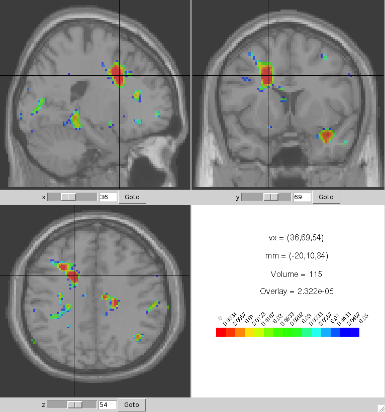

# neurocdf

# Installation

Installation from R

    library(devtools)
    install_bitbucket("neurocdf","kkholst")

## `netcdf 4` dependency

## Mac OS X:

Install either via [homebrew](http://brew.sh):

    brew install netcdf --enable-cxx-compat --enable-fortran

or [macports](http://www.macports.org/%E2%80%8E):

    sudo port install netcdf +gcc47

Install `ncdf4` from CRAN:

    install.packages("ncdf4",type="source")

## Unix/Linux

NetCDF should be part of your distribution or compile from [source](http://www.unidata.ucar.edu/downloads/netcdf/index.jsp).

Install `ncdf4` from CRAN

    install.packages("ncdf4",type="source")

## Windows

Install binary `ncdf4` from <http://cirrus.ucsd.edu/~pierce/ncdf/>
